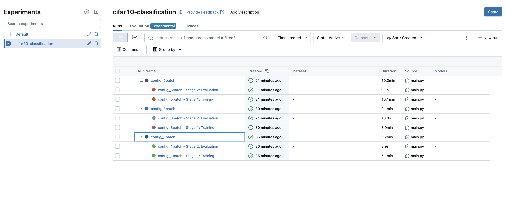
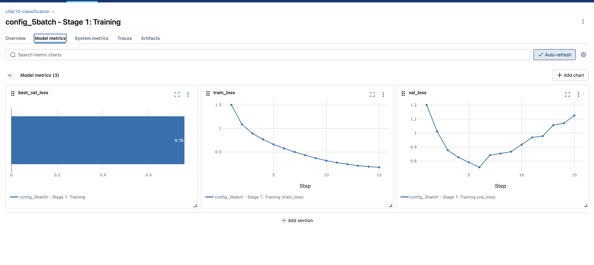
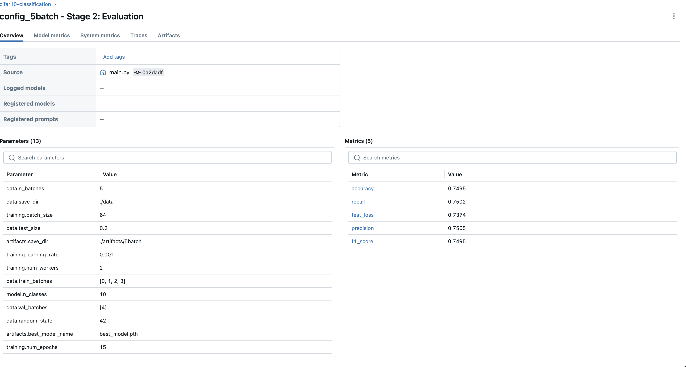
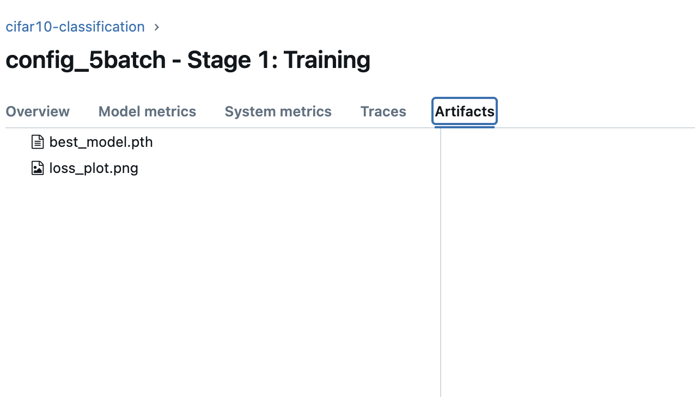
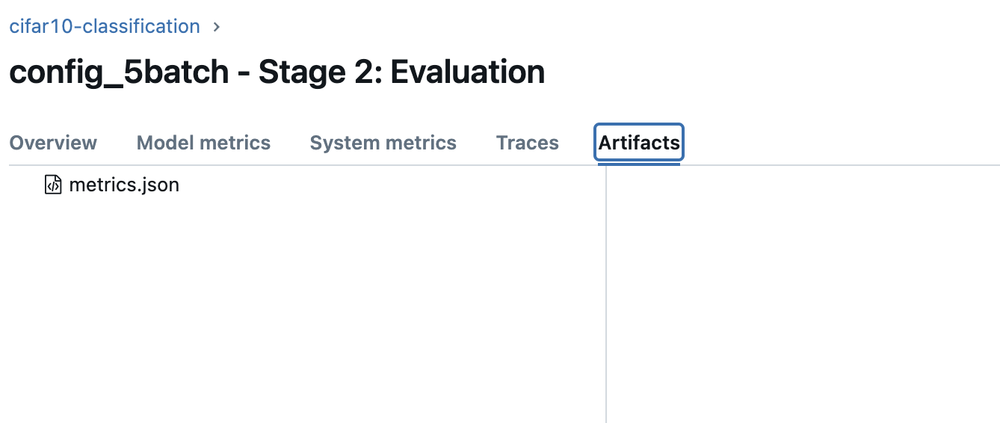
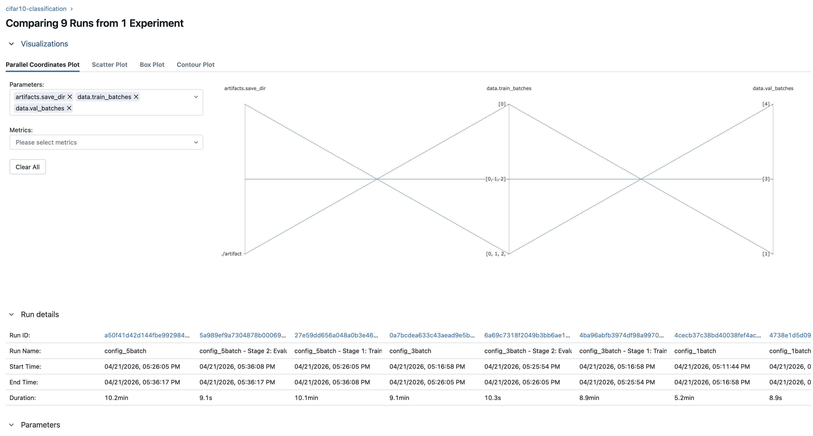
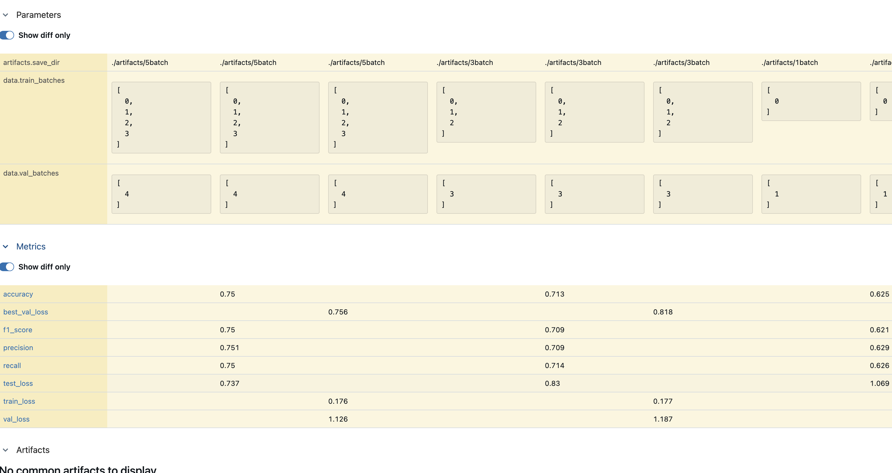

# Lab 4 Report: MLflow Experiment Tracking and Artifact Management

## 1. Introduction

In machine learning workflows, tracking experiments is essential for reproducibility and informed decision-making. As models are retrained with different data sizes, hyperparameters, or architectures, it becomes difficult to remember which configuration produced which result. Manual tracking via spreadsheets or log files is error-prone and doesn't scale.

**MLflow** is an open-source platform that solves this by providing:
- **Experiment tracking** — log parameters, metrics (per epoch), and artifacts for every run
- **A web UI** — compare runs side by side, visualize metric curves, download artifacts
- **Artifact storage** — store model weights, plots, configs alongside each run

In this lab, we integrated MLflow into our CIFAR-10 classification pipeline (from Labs 2-3), logging all relevant information for 3 different data configurations.

## 2. Tracking Server Setup

### Installation

MLflow was added as a dependency in `pyproject.toml` and installed via Poetry:

```toml
[tool.poetry.dependencies]
mlflow = "^2.0"
```

### Running the Server

The local tracking server is started with:

```bash
poetry run mlflow ui
```

This launches the MLflow UI at `http://localhost:5000`, storing all run data in a local `mlruns/` directory. The `.gitignore` excludes `mlruns/` and `mlartifacts/` from version control.

### Integration

MLflow is integrated directly into the pipeline code:
- `src/main.py` creates the experiment, starts parent runs, and spawns nested child runs
- `src/train.py` logs per-epoch training metrics and model artifacts (inside Stage 1 child run)
- `src/evaluate.py` logs test metrics and the metrics JSON file (inside Stage 2 child run)



## 3. Logging Details

### Parameters (Part 2)

All configuration values from each YAML config are logged as MLflow parameters using flattened dot notation (e.g., `training.learning_rate`, `data.train_batches`). Parameters are logged at both the parent run level and each child run level for easy filtering.

13 parameters are logged per run, including:
- `data.train_batches`, `data.val_batches` — which data batches to use
- `training.learning_rate`, `training.batch_size`, `training.num_epochs`
- `model.n_classes`, `data.random_state`, `data.test_size`

### Metrics (Part 2)

Metrics are split across child runs by stage:

**Stage 1: Training** logs per-epoch metrics (with `step=epoch`):
- `train_loss` — average training loss per epoch
- `val_loss` — average validation loss per epoch
- `best_val_loss` — the best validation loss achieved

These are visualized as line charts in the MLflow UI, making it easy to spot overfitting.



**Stage 2: Evaluation** logs final test metrics (logged once):
- `accuracy`, `precision`, `recall`, `f1_score`, `test_loss`



### Artifacts (Part 3)

Artifacts are split across child runs by stage:

**Stage 1: Training** logs:
- `best_model.pth` — trained model weights
- `loss_plot.png` — training/validation loss curve



**Stage 2: Evaluation** logs:
- `metrics.json` — test metrics in JSON format



The parent run also logs the `config_*.yaml` file as an artifact.

The logged model can be downloaded directly from the Artifacts tab and loaded for inference:

```python
model = SimpleCNN(n_classes=10)
model.load_state_dict(torch.load("best_model.pth", weights_only=True))
model.eval()
```

## 4. Experimentation Process (Part 4)

### Experiment and Run Management

A single MLflow experiment named `cifar10-classification` was created. Three parent runs were logged, each with two nested child runs:

| Run Name       | Train Batches | Train Samples | Accuracy | F1 Score | Test Loss |
|----------------|---------------|---------------|----------|----------|-----------|
| config_1batch  | [0]           | 8,000         | 62.51%   | 62.13%   | 1.0687    |
| config_3batch  | [0, 1, 2]    | 24,000        | 71.31%   | 70.88%   | 0.8297    |
| config_5batch  | [0, 1, 2, 3] | 32,000        | 74.95%   | 74.95%   | 0.7374    |

All runs share the same test set (10k samples, fixed seed=42) for fair comparison.

### Run Comparison

The MLflow UI's **Compare** feature was used to analyze all runs side by side:

**Parallel coordinates plot** — visualizes how parameters relate to outcomes. The plot clearly shows that more training batches leads to better metrics.



**Parameters and metrics diff** — shows only the differing parameters across runs, with all metrics compared in a single table. Accuracy scales from 0.625 (1 batch) to 0.750 (4 batches).



### Run Name Hierarchy

Each configuration gets a **parent run** named after the config (e.g., `config_5batch`), with two **nested child runs** representing pipeline stages:

```
config_5batch                          (parent — holds params + config artifact)
├── config_5batch - Stage 1: Training  (child — per-epoch train/val loss, model, loss plot)
└── config_5batch - Stage 2: Evaluation (child — test metrics, metrics.json)
```

This hierarchy makes it clear at a glance:
- Which configuration was used (parent run name)
- Which stage produced which metrics (child run names)
- The full pipeline structure for each experiment

The MLflow UI displays nested runs indented under their parent, as visible in the experiment list screenshot above.

## 5. Reflection

### Benefits of MLflow

- **Centralized tracking:** All parameters, metrics, and artifacts are in one place — no more searching through log files or manually recording results
- **Visual comparison:** The UI makes it immediately obvious that more training data improves accuracy (62.51% → 74.95%), with per-epoch charts showing where overfitting begins
- **Artifact management:** Model weights are stored alongside the config that produced them, eliminating the "which model goes with which config?" problem
- **Low integration cost:** Adding MLflow to existing code required only ~20 lines of changes (import, set_experiment, start_run, log_params, log_metrics, log_artifact)
- **Hierarchical runs:** Nested child runs cleanly separate training and evaluation stages, making it easy to navigate and understand the pipeline structure

### Challenges

- **Local storage only:** The current setup uses local `mlruns/` storage. For team collaboration, a remote tracking server (e.g., MLflow on a shared VM or managed service) would be needed
- **No automatic model registry:** We log models as raw artifacts rather than using MLflow's model registry, which would enable versioning and deployment staging
- **Duplicate data loading:** Each run re-loads all 50k samples to split off the test set, which is redundant across runs

### Possible Improvements

- Set up a remote MLflow tracking server for team access
- Use `mlflow.pytorch.log_model()` instead of raw artifact logging for better model versioning
- Integrate with MLflow Model Registry for deployment workflows
- Add hyperparameter tuning (e.g., learning rate sweep) with more runs for richer comparison
- Combine with DVC (Lab 3) for both data versioning and experiment tracking
