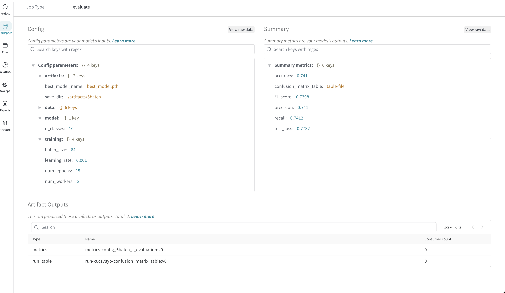
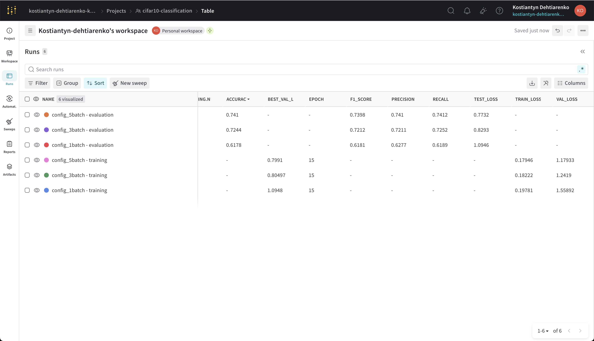
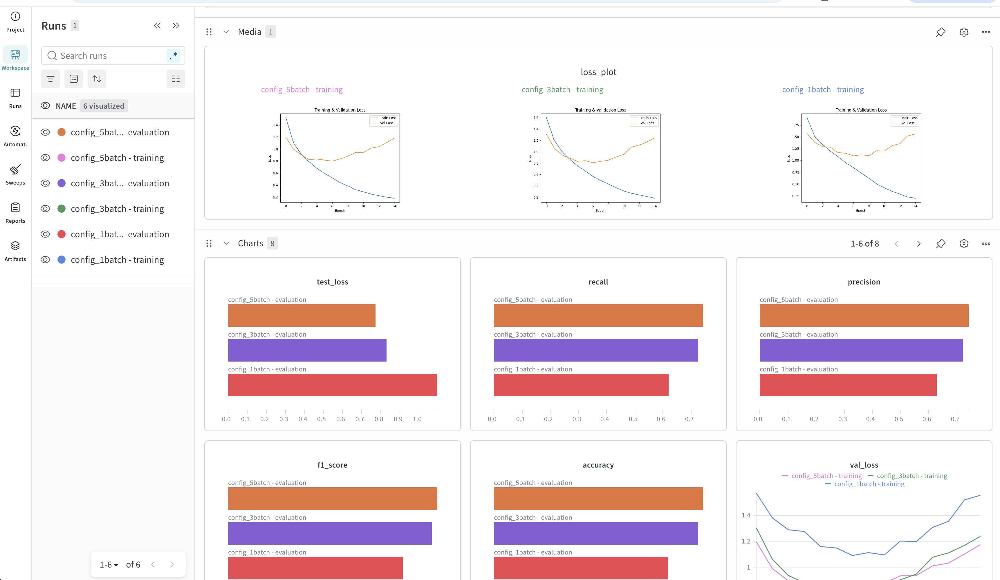
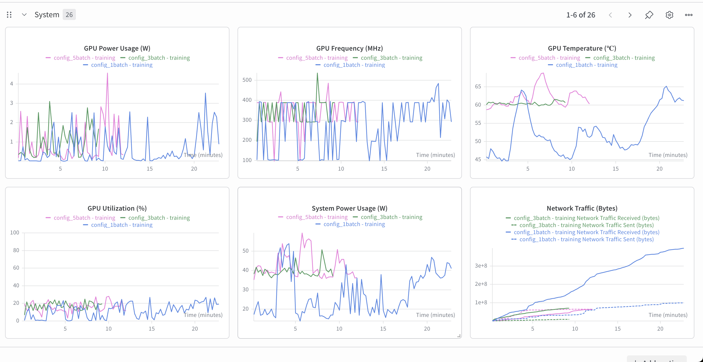
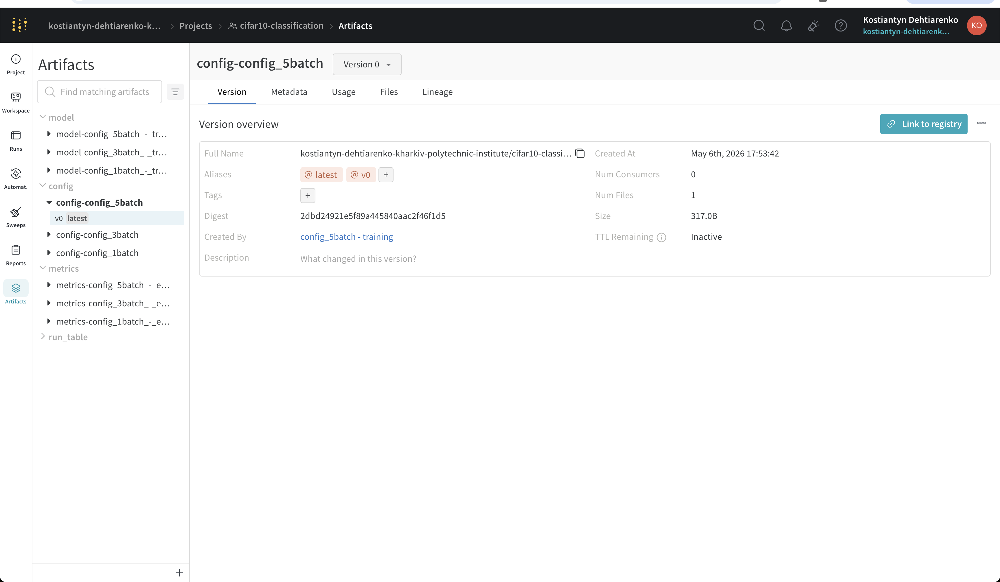
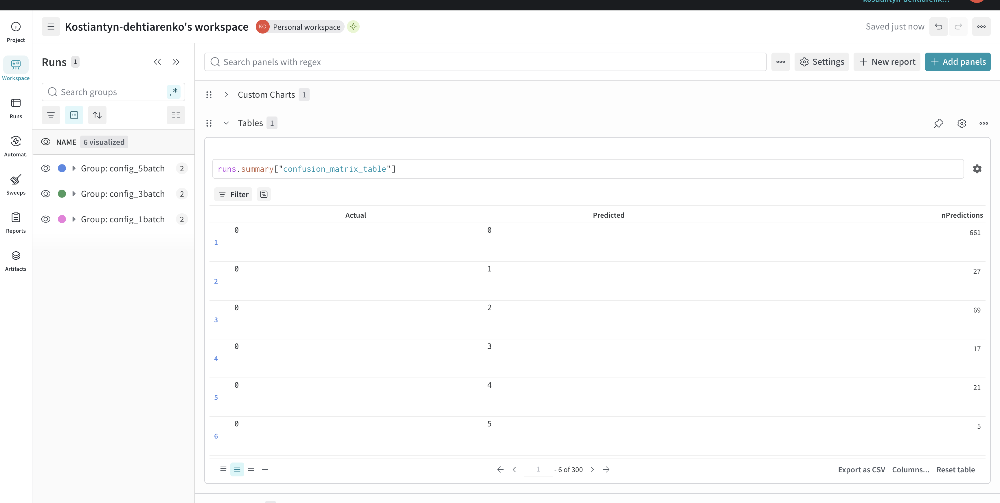
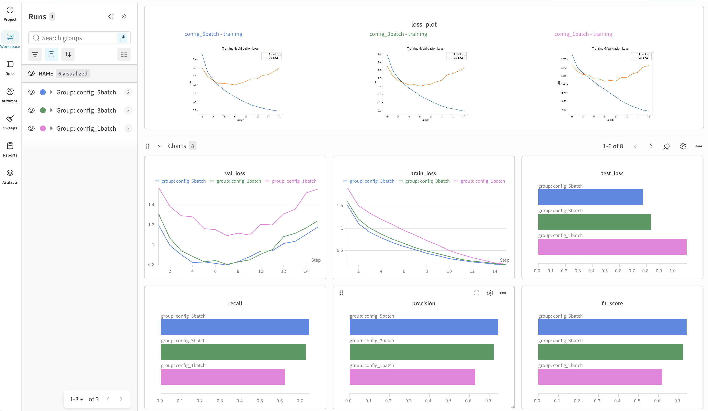
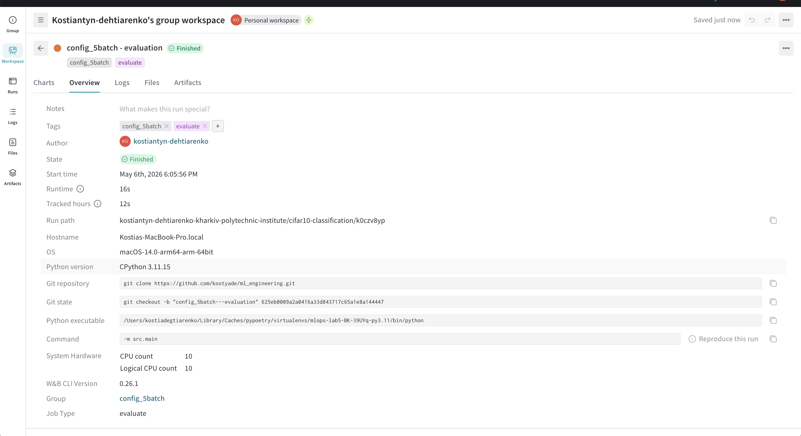

# Lab 5 Report: Weights & Biases Experiment Tracking and Artifact Management

## 1. Introduction

Tracking machine learning experiments is essential for reproducibility, collaboration, and informed decision-making. As we vary hyperparameters or training data, it becomes hard to remember which configuration produced which result. Manual tracking via spreadsheets is error-prone and unscalable.

**Weights & Biases (W&B)** is a cloud-hosted experiment tracking platform that provides:
- **Cloud-hosted runs** — no local server to maintain (unlike MLflow in Lab 4)
- **Automatic system metrics** — CPU/GPU/memory/network usage logged for free
- **Rich visualizations** — built-in charts, parallel coordinates, confusion matrices, custom panels
- **Artifact versioning** — model weights, configs, and metrics tied to runs and lineage-tracked

In this lab, we integrated W&B into our CIFAR-10 classification pipeline (carried forward from Labs 2-4), logging parameters, metrics, and artifacts for 3 different data configurations.

## 2. Tracking Setup

### Installation and Authentication

W&B was added as a dependency in `pyproject.toml`:

```toml
[tool.poetry.dependencies]
wandb = ">=0.25.1"
```

Authentication is one-time per machine via `wandb login`, which stores the API key in `~/.netrc`. The `.gitignore` excludes the local `wandb/` cache directory and the `.netrc` file.

### Project Setup

A new W&B project named `cifar10-classification` was created under the entity `kostiantyn-dehtiarenko-kharkiv-polytechnic-institute`. Each run automatically uploads to this project at:

`https://wandb.ai/kostiantyn-dehtiarenko-kharkiv-polytechnic-institute/cifar10-classification`

### Code Integration

W&B is integrated directly into the pipeline:
- `src/main.py` orchestrates 3 configs and starts 2 W&B runs per config (training + evaluation)
- `src/train.py` logs per-epoch metrics, the loss plot, and the model artifact
- `src/evaluate.py` logs final test metrics, the metrics JSON artifact, and a confusion matrix

The dashboard immediately displays our runs after the script finishes:



## 3. Logging Details

### Parameters via `wandb.config`

All YAML config values are passed to W&B via the `config=config` argument of `wandb.init()`. This populates `wandb.config`, which is searchable and filterable in the UI. 13 parameters are logged per run, organized hierarchically:



The Config section shows nested groupings (`artifacts`, `data`, `model`, `training`) matching the YAML structure. The Summary section on the right shows the final logged metrics for the run.

### Metrics

Two types of metrics are logged:

**Per-epoch metrics** (logged with `wandb.log({...}, step=epoch)`):
- `train_loss`, `val_loss` — visualized as line charts in the Workspace tab

**Final metrics** (logged once after evaluation):
- `accuracy`, `precision`, `recall`, `f1_score`, `test_loss` — also written to `wandb.summary` for easy comparison in the runs table



### Automatic System Metrics

W&B automatically captures hardware and environment metrics for every run with no extra code — a major advantage over MLflow:



### Artifacts (Part 3)

Each run logs artifacts via `wandb.log_artifact()`:

- **Training run** logs:
  - `model-<run>` (type: `model`) — best CIFAR-10 model weights
  - `config-<config>` (type: `config`) — YAML configuration file
  - `loss_plot.png` — training/validation loss curve image
- **Evaluation run** logs:
  - `metrics-<run>` (type: `metrics`) — test metrics JSON

Artifacts are version-tracked with lineage (which run created/consumed them):



The logged model can be downloaded directly from the W&B UI or programmatically:

```python
import wandb
run = wandb.init(project="cifar10-classification")
artifact = run.use_artifact(
    "kostiantyn-dehtiarenko-kharkiv-polytechnic-institute/cifar10-classification/model-config_5batch - training:latest"
)
model_dir = artifact.download()  # contains best_model.pth

import torch
from src.model import SimpleCNN
model = SimpleCNN(n_classes=10)
model.load_state_dict(torch.load(f"{model_dir}/best_model.pth", weights_only=True))
model.eval()
```

### Custom Visualizations (Bonus)

Beyond the standard line/bar charts, we logged a **confusion matrix** for each evaluation run using `wandb.plot.confusion_matrix()`:



This shows the predicted-vs-actual class distribution for the 10 CIFAR-10 classes, useful for analyzing per-class errors.

## 4. Experimentation Process

### Run Management

Three configurations were trained, each producing 2 grouped W&B runs. Final test results:

| Run Group     | Train Batches      | Train Samples | Accuracy | F1 Score | Test Loss |
|---------------|-------------------|---------------|----------|----------|-----------|
| config_1batch | [0]               | 8,000         | 61.78%   | 61.81%   | 1.0946    |
| config_3batch | [0, 1, 2]         | 24,000        | 72.44%   | 72.12%   | 0.8293    |
| config_5batch | [0, 1, 2, 3]      | 32,000        | 74.10%   | 73.98%   | 0.7732    |

The clear trend — more training data → better metrics — is consistent with Labs 2-4 and confirms the pipeline works equivalently under W&B tracking.

### Run Naming Hierarchy (Bonus)

Each configuration uses a structured 2-level naming convention:

- **Group:** `config_1batch` / `config_3batch` / `config_5batch` — clusters runs in the W&B UI
- **Run names:** `<group> - training` and `<group> - evaluation` — distinguish pipeline stages
- **Job types:** `train` / `evaluate` — enables filtering by stage
- **Tags:** the group name + stage tag — enables additional filtering

Grouping in the W&B UI collapses related runs together, making it easy to compare across configs:



### Run Comparison

Selecting individual runs shows their full overview, including environment, command, runtime, and source git state — useful for reproducing any experiment:



The grouped workspace view (above) provides effective side-by-side comparison: training/validation loss curves overlaid for all 3 configs, plus bar charts for final test metrics. The comparison clearly shows:
- **val_loss** chart — `config_5batch` reaches the lowest loss earliest
- **test_loss bars** — `config_1batch` is highest (1.09), `config_5batch` lowest (0.77)
- **accuracy/precision/recall/f1_score bars** — monotonic improvement with more data

## 5. Reflection

### Benefits of W&B

- **Zero-config server:** No local tracking server to spin up — everything runs in the cloud, accessible from any machine
- **Automatic system metrics:** CPU/GPU/network logged for every run with no code, useful for debugging slow training
- **Run grouping:** Native support for grouping related runs (parent/child semantics) — cleaner than MLflow's nested runs
- **Rich built-in visualizations:** Confusion matrix, parallel coordinates, parameter importance — all without writing custom code
- **Artifact lineage:** Knowing which run produced and consumed which artifact, with version history
- **Sharing:** Public/private project URLs make sharing experiments with the team trivial

### Challenges

- **Cloud-only by default:** Free tier is fine for small projects, but data leaves your machine. Self-hosting (`wandb-server`) is possible but more complex than MLflow's local mode
- **Vendor lock-in:** API and UI are W&B-specific — moving to another platform requires rewriting integration code
- **Network dependency:** First run downloads several MB of W&B SDK and uploads artifacts — slower than MLflow's local file mode if internet is flaky
- **Run finalization overhead:** Each `wandb.finish()` waits for the final sync, adding a few seconds per run
- **Pricing for teams:** Free tier covers personal use, but team/enterprise features (RBAC, SSO, audit logs) require paid plans

### Possible Improvements

- **Hyperparameter sweeps:** Use `wandb.sweep` for automated grid/random/Bayesian hyperparameter search instead of manually defining 3 configs
- **Custom panels:** Build a project-level Report combining the loss plots, confusion matrices, and per-config comparison into a single shareable document
- **Model registry:** Promote the best `model-*` artifact to a registered model with stages (staging/production) for deployment workflows
- **Alerts:** Configure W&B alerts for runs that fail or have anomalous metrics (e.g., `val_loss` not decreasing)
- **Combine with DVC (Lab 3):** Use DVC for data versioning + W&B for experiment tracking — they complement each other (DVC for inputs, W&B for outputs/observability)
- **Compare to MLflow:** This project now exists in both MLflow (Lab 4) and W&B (Lab 5). A side-by-side comparison report could highlight which features each handles better for our specific needs.
