# Lab 6 Report: Streamlit Interactive Model Analysis Dashboard

## 1. Introduction

After training a model, we still need to inspect the data, see where the model fails, and understand individual predictions. Doing this in notebooks is slow — every new question means re-running cells.

An interactive dashboard makes this much faster. Anyone can explore the model through a UI without writing code, which is useful for both debugging and monitoring.

In this lab we built a **Streamlit dashboard** for the CIFAR-10 pipeline from Labs 2-4. It has three tabs: **Dataset Exploration**, **Error Analysis** (powered by MLflow), and **Prediction & Explainability** (using Grad-CAM). The dashboard never trains — it only loads models that were already tracked in Lab 4.

## 2. Architecture Description

The application is intentionally split across small modules so the UI layer is thin and the underlying logic is reusable.

```
lab6/
├── app.py                    # Streamlit entry — sidebar + 3 tabs (50 lines)
├── config.yaml               # MLflow URI, dataset paths, last conv layer name
├── pyproject.toml            # Poetry deps: streamlit, mlflow, torch, plotly, PIL
└── src/
    ├── config.py             # YAML loader
    ├── model.py              # SimpleCNN (copied from Lab 5)
    ├── data.py               # CIFAR-10 loader, splits, normalization, CIFAR10_CLASSES
    ├── mlflow_utils.py       # list_runs_with_model(), download_model_artifact()
    ├── inference.py          # Batch inference + checkpoint loader
    ├── viz.py                # Plotly figures + heatmap overlay
    ├── gradcam.py            # Grad-CAM with forward/backward hooks
    └── tabs/
        ├── dataset_tab.py    # Tab 1 UI
        ├── errors_tab.py     # Tab 2 UI
        └── predict_tab.py    # Tab 3 UI
```

### Key design choices

- **Separation of concerns** — `app.py` only wires together tabs; each tab module owns its UI but defers to `src/*` modules for data, MLflow, inference, and viz. No business logic lives in the UI layer.
- **MLflow as the single source of truth** — the dashboard never trains; it always loads a `best_model.pth` artifact from a tracked run (`mlflow.artifacts.download_artifacts(run_id, "best_model.pth")`). The user picks the run, the dashboard runs inference against the same deterministic test set Labs 2-5 evaluated against (seed=42 stratified split).
- **Caching for snappy interaction** — `@st.cache_data` for the CIFAR-10 test split and inference results (keyed by `run_id`), `@st.cache_resource` for the loaded PyTorch model. The expensive 10k-sample forward pass happens once per run; subsequent slider/filter interactions are instant.
- **Reproducibility** — `torch.manual_seed(0)` + `np.random.seed(0)` set at app start. The test split uses the same `random_state=42` as the training pipeline, so the test set is byte-identical across labs.
- **Graceful failure** — every MLflow/inference call is wrapped in `try/except` with `st.error`/`st.warning` messages and `logger.exception()` for stack traces. Missing runs, missing data, and invalid uploads all fail with user-readable messages instead of stack traces.

## 3. Dataset Analysis

The **Dataset Exploration** tab shows that CIFAR-10 is balanced — ~4 000 samples per class in the train split and ~1 000 per class in the test split after the 80/20 stratified test split.

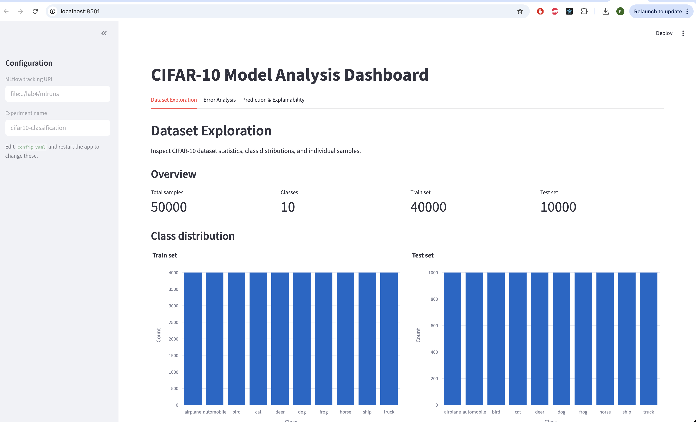

The sample inspector renders individual 32×32 images so we can sanity-check labels:

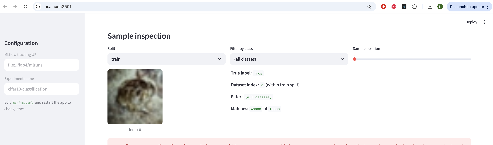

Class filtering makes browsing manageable — at 4 000 samples per class, the slider directly navigates within one category:

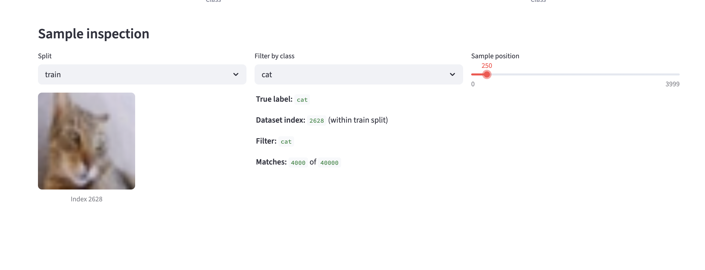

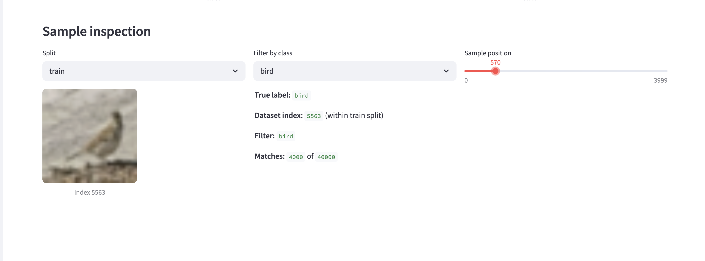

Insights from browsing:
- CIFAR-10 images are very low-resolution (32×32), often blurry, and frequently contain multiple subjects (animals partially out of frame, cluttered backgrounds). This explains why human-level accuracy is around 94% — even people misclassify some samples.
- Class distribution is perfectly uniform (stratified split + balanced source data), so accuracy is a fair top-line metric without needing class-weighted alternatives.

## 4. Error Analysis

The **Error Analysis** tab queries Lab 4's MLflow runs, loads the `best_model.pth` artifact for the selected run, and runs inference on the test set. The screenshot below shows the `config_5batch` training run (the strongest model from Lab 4):

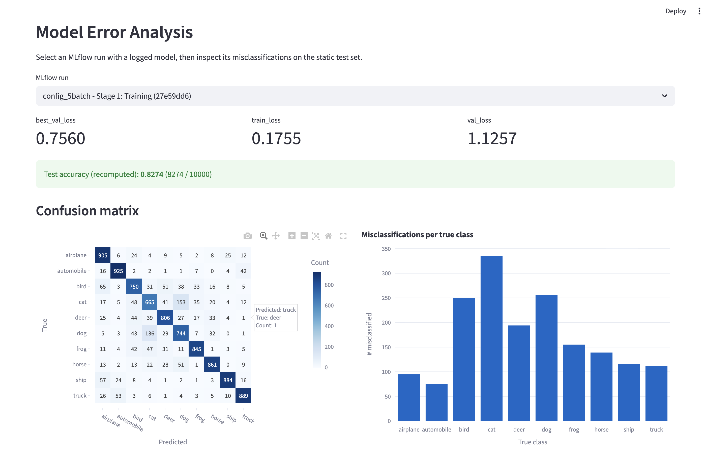

Recomputed test accuracy is **82.74%** (8 274 / 10 000 correct) on the deterministic test split. The confusion matrix surfaces the typical CIFAR-10 failure patterns:

- **Cat ↔ dog** confusion is the largest single off-diagonal cluster (~150 errors each direction) — small mammals with similar texture/shape at 32×32 are genuinely hard.
- **Bird ↔ airplane** confusion appears too — both are small objects against sky backgrounds.
- **Vehicle classes** (automobile, truck, ship, airplane) are mostly well separated from animal classes; most errors stay within their semantic neighborhood.

The per-class error bar chart confirms that **cat** is the hardest class (most misclassifications), followed by dog and deer.

Sorting misclassified examples by **highest confidence** surfaces the model's most confident mistakes — the cases where it's *most wrong*:

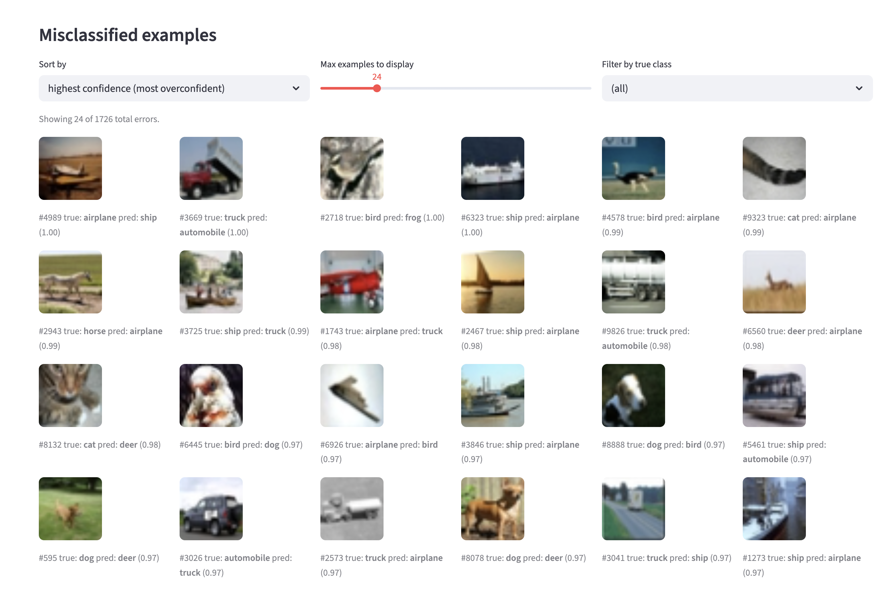

The grid shows things like:
- A horse image confidently predicted as "airplane" — likely a horse against open sky.
- Bird images predicted as "frog" or "deer" — often poses where the bird body shape resembles a small mammal.
- Ship images predicted as "airplane" — both have rectangular structures against open backgrounds.

This is exactly the kind of view that a static metrics dashboard hides: aggregate accuracy says "82.7%", but inspecting overconfident errors tells us *which kinds of features the model is over-relying on*.

## 5. Explainability Results

The **Prediction & Explainability** tab applies **Grad-CAM** to the last convolutional layer (`features.6`, the `Conv2d(64 → 128, 3×3)` block of `SimpleCNN`). The 4×4 activation map is upsampled to 32×32 with bilinear interpolation, ReLU'd, normalized, and overlaid via a jet colormap.

### Example 1 — confident incorrect prediction (cat predicted as frog)

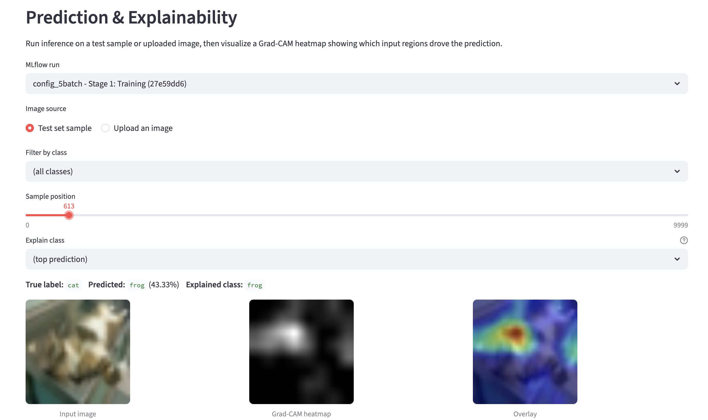

The heatmap is concentrated on the upper-right region of the image where the model is "looking" for frog evidence. Looking at the input, the model is partly seeing what looks like a green/grey blob with curved contours — features that could plausibly belong to a frog. This is a useful debugging insight: the model isn't focused on the face/whiskers of the cat (which would lead to the correct prediction), but on a background region.

The probability bar for this sample shows the model's uncertainty — frog at 43% but cat at 38%, a near-tie:

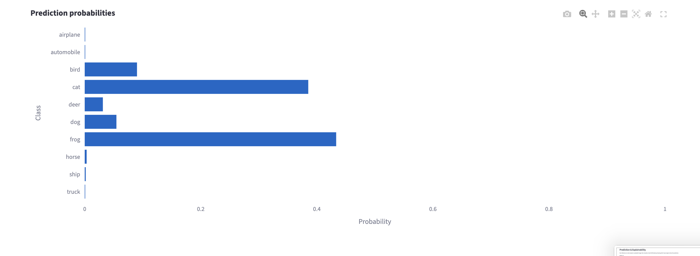

### Example 2 — confident correct prediction (cat)

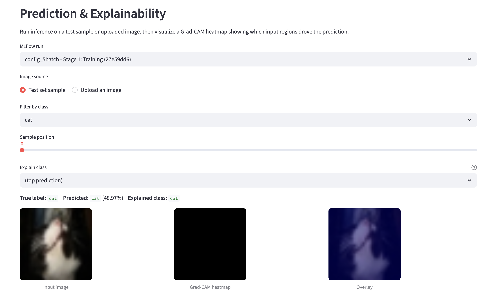

For a correctly-classified cat, the Grad-CAM heatmap is much more diffuse — the model isn't latching onto one particular region. The probability bar shows the model's lower confidence here (48% cat, 38% dog) — even correctly-classified samples sometimes have weak heatmaps when the model is borderline:

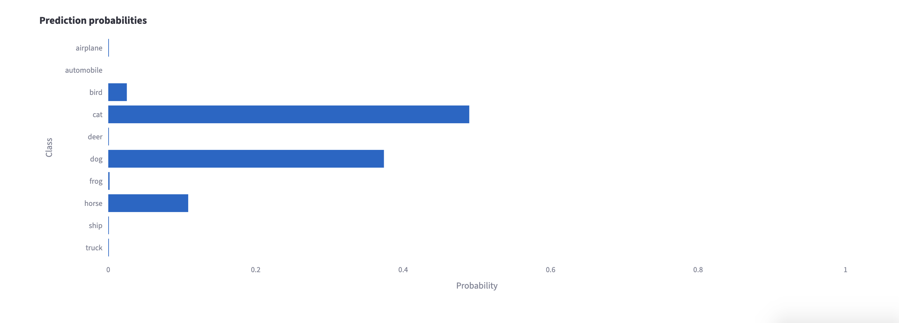

### Example 3 — explaining alternative classes (bonus feature)

The "Explain class" dropdown lets us see what evidence the model has for *any* class, not just the top prediction. For the same correctly-classified cat:

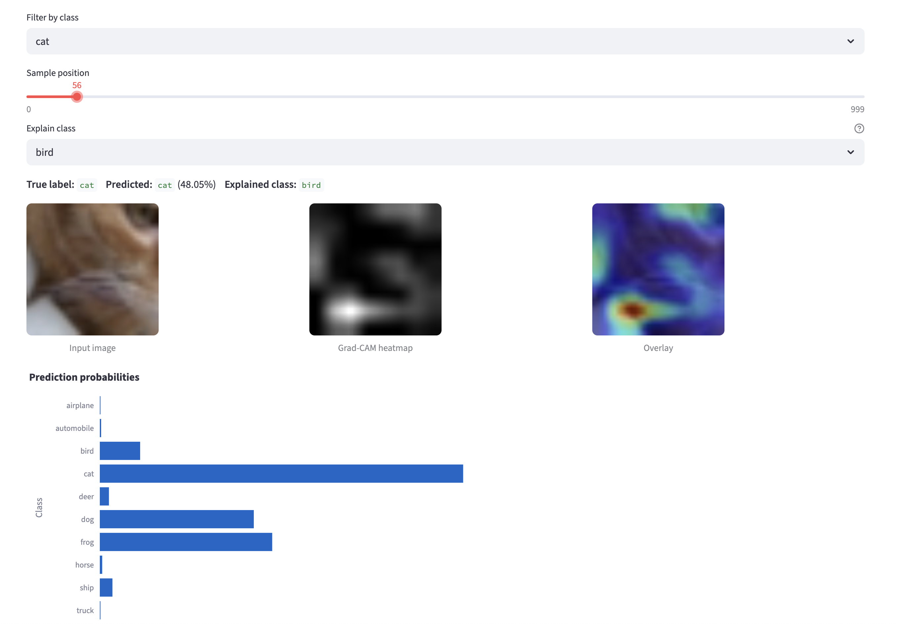

The "bird" heatmap highlights different regions — the model is looking for bird-like features in completely different parts of the image. Switching back to the top class (cat) shows where the cat evidence actually lives:

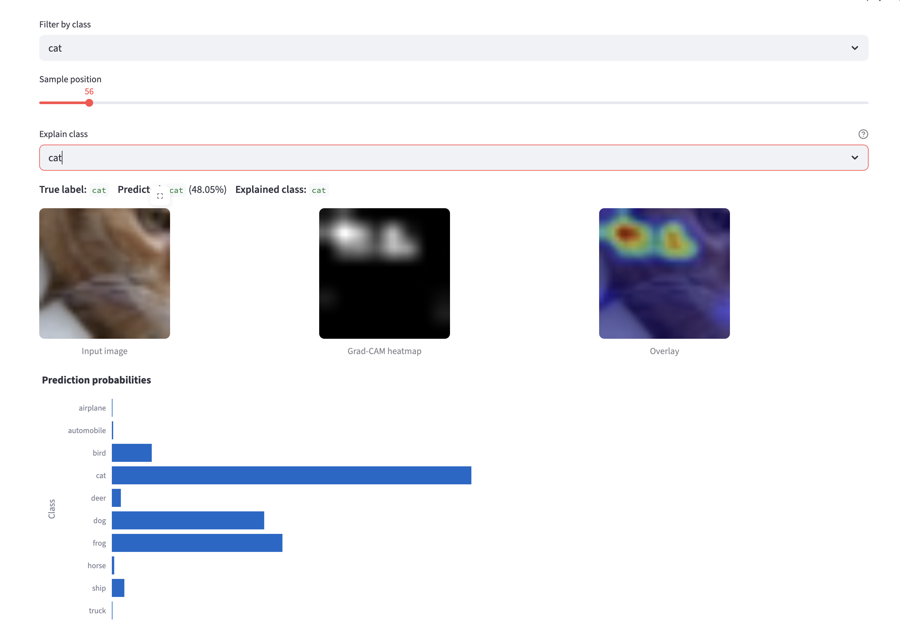

This side-by-side view makes it concrete that Grad-CAM isn't just visualizing "where the model is looking" — it's visualizing "where the model is finding evidence for a specific class." Two different target classes on the same image produce two different heatmaps.

### Example 4 — out-of-distribution uploaded image

Uploading a higher-resolution real-world bird photo (auto-resized to 32×32):

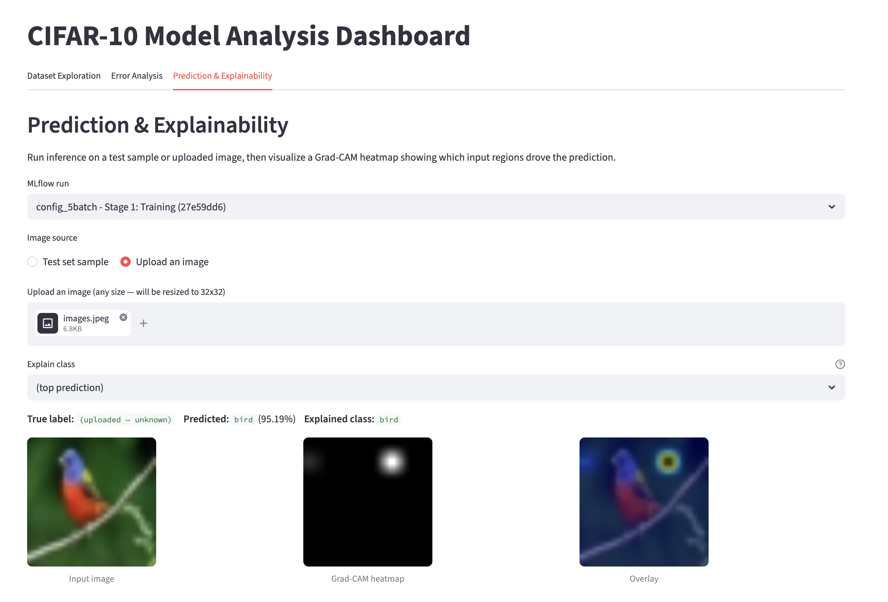

The Grad-CAM heatmap pinpoints exactly where the bird's head is — a textbook success case. The probability bar confirms the model is very confident (95%):

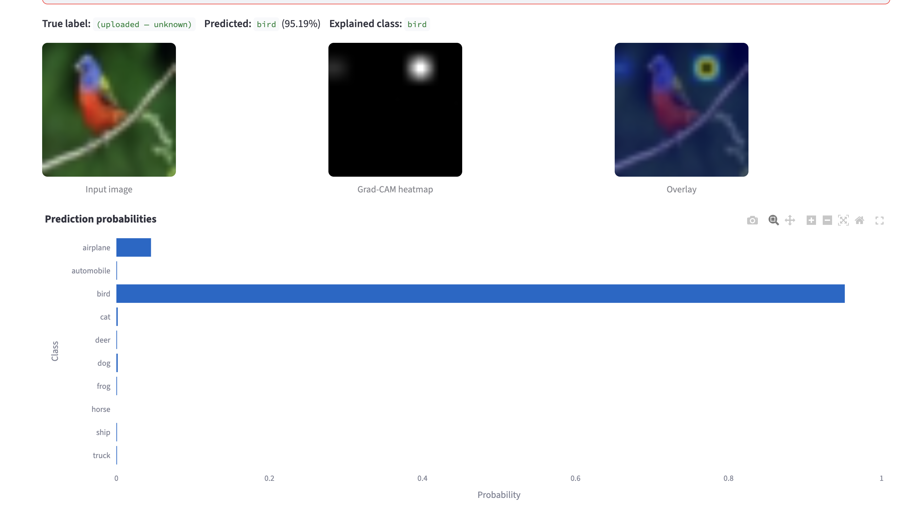

Switching the explained class to "automobile" on the same bird image shows the model's *implicit* evidence for the wrong class — and the heatmap highlights the branch the bird is sitting on (long, horizontal, somewhat metallic-looking after downsizing):

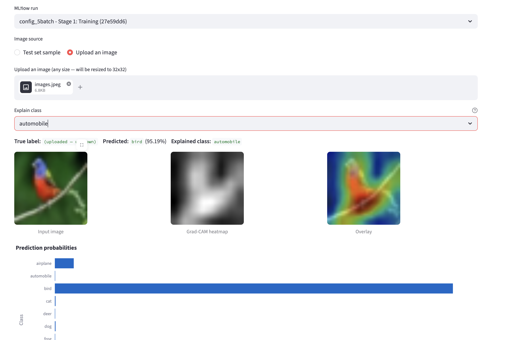

This is a useful interpretability story: the model is using sensible features (the bird's head for "bird", linear horizontal structure for "automobile") even when the overall prediction is correct.

## 6. Engineering Reflection

### Design decisions

- **MLflow over W&B** — the assignment specifies MLflow integration. Lab 4 already has runs logged with the artifact + parent/child structure we need, so the dashboard reads from `file:../lab4/mlruns` and the user is never aware of MLflow's storage format. If we needed to switch to W&B later, only `src/mlflow_utils.py` would need rewriting.
- **Grad-CAM over LIME** — for a CNN on 32×32 images, Grad-CAM is the natural fit: one forward + one backward pass, no extra hyperparameters, no surrogate model. LIME would have required perturbation sampling (slower, less interpretable on such low-res inputs). We use only torch primitives — no extra dependency.
- **Tab modules** — each tab is a single Python module with a `render(config)` function. New tabs can be added by writing a module and one line in `app.py`. There's no central state object the tabs share, by design — each tab queries MLflow / loads data independently, with caching to keep this cheap.
- **Streamlit caching** — the heaviest call is the 10k-sample test-set inference. By making it `@st.cache_data(run_id, ...)`, we pay it once per (run, app session). Subsequent slider moves, sort changes, and class filters are instantaneous because the cached prediction arrays don't change.

### Limitations and trade-offs

- **Local-file MLflow URI** — the tracking URI is `file:../lab4/mlruns`, which only works when lab4 sits next to lab6. For a real deployment we'd point to a remote tracking server, but for a per-student lab this is the simplest setup.
- **Static test set** — the dashboard always evaluates on the 10k-sample stratified split with seed=42. This is correct for comparing Lab 4 runs (they were evaluated on the same set), but if the underlying data changed, the dashboard wouldn't catch it.
- **No streaming inference / batching for the upload tab** — single-image inference is fast enough that we forward + backward through the whole model on every slider move. A production app would batch and reuse activations.
- **Grad-CAM only on the last conv layer** — earlier layers produce different (finer-grained) explanations. We expose this in `config.yaml` (`last_conv_layer: features.6`) but don't expose a UI selector — would be a useful extension.
- **No model comparison tab** — picking two runs side-by-side (their confusion matrices, their predictions on the same sample) would be a natural next feature. Achievable with `st.columns(2)` and a second `selectbox`.

### Engineering practices applied

- **Configuration management** — every path, URI, and layer name lives in `config.yaml`. No hard-coded values in the code.
- **Logging** — Python `logging` throughout; UI errors go to `st.error` while the underlying exception goes to logs.
- **Error handling** — missing MLflow runs → `st.warning`; corrupted checkpoint → `st.error`; invalid uploaded image → caught at PIL open.
- **Dependency management** — Poetry with pinned major versions; reproducible installs.
- **Modularity** — clean separation between UI, data, MLflow, inference, viz, and explainability code. Each module is under 150 lines.
